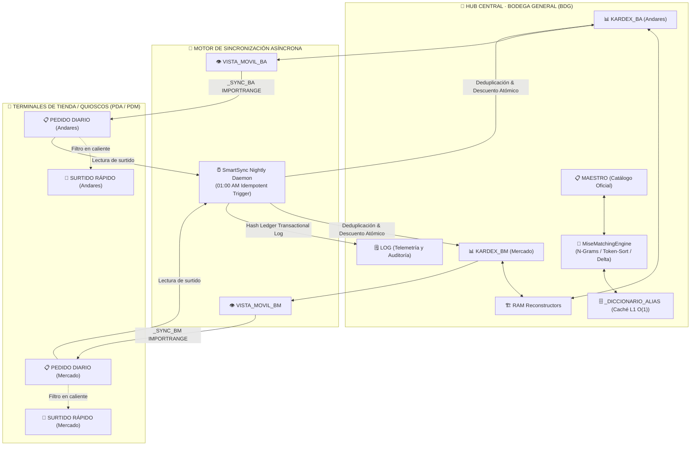

# ⚡ Suite MISE · Enterprise Inventory & Supply Chain Engine
> **Plataforma Integral de Telemetría de Inventarios, Reconciliación Inteligente de Insumos, Picking Dinámico y Sincronización Asíncrona para La Crêpe Parisienne (Grupo MYT).**

[](CHANGELOG_PUBLIC.md)
[](https://developers.google.com/apps-script)
[-388E3C.svg?style=flat-square)](tests/)
[](#-arquitectura-del-sistema)
[](#)

---

## 🏛️ Arquitectura del Sistema

Suite MISE opera bajo una topología distribuida de **tres niveles (Hub-and-Spoke)** diseñada para desacoplar el módulo central de almacenamiento de las terminales de venta en quioscos, garantizando atomicidad transaccional y cero colisiones operativas:



---

## ✨ Capacidades Clave (Core Engineering)

### 1. 🧠 Motor Matemático de Reconciliación (`MiseMatchingEngine`)
Erradica la fragilidad de listas y diccionarios estáticos hardcodeados mediante un modelo de evaluación morfológica compuesto:

$$\text{Score} = 0.50 \cdot \text{TokenOverlap} + 0.25 \cdot \text{NGramJaccard} + 0.25 \cdot \text{TokenSortRatio}$$

* **Sanitización Universal de Ruido**: Remueve de forma determinista puntuación, acentuación y expresiones de empaque/peso (`450 g`, `1 kg`, `.450`, `bot`, `man`, `dom`, `pz`, etc.).
* **Margen de Victoria Anti-Ambigüedad ($\Delta$)**:  
  $$\text{MATCH} \iff (\text{Score}_1 \ge 0.55 \land \Delta \ge 0.10) \lor \text{Score}_1 \ge 0.75$$  
  Si existe un empate o duda semántica (ej. *Pistache Sin Cáscara* vs *Pistache Tostado* / *Untable*), el sistema **no inventa**: desvía el insumo a `⚠️ REVISIÓN_HUÉRFANOS` con respaldo total de sus valores.
* **Caché L1 en Hoja Oculta (`_DICCIONARIO_ALIAS`)**: Almacén persistente de capacidad ilimitada que indexa equivalencias aprobadas para resolución instantánea $O(1)$.

### 2. 🖥️ Reconciliador Asistido Visual (Human-in-the-Loop)
* Modal interactivo (`HtmlService`) accesible desde `⚙️ Mise > 📊 Mantenimiento y Blindaje > 🧠 Reconciliador Inteligente de Huérfanos`.
* Permite al administrador inspeccionar discrepancias detectadas, evaluar el porcentaje de similitud calculado y asociar el alias oficial en un solo clic, auto-resolviendo la cuarentena de por vida.

### 3. 🏗️ Reconstructores Resilientes con Respaldo en Memoria RAM
* Mecanismo de auto-reparación ante anomalías físicas en hojas de cálculo (ej. celdas combinadas rotas, inserción accidental de columnas o desalineación de la cuadrícula).
* Respalda en memoria RAM JS todos los saldos anteriores, lotes, caducidades y movimientos de 7 días, destruye la cuadrícula corrupta, redibuja 30 columnas simétricas e inyecta los datos reconciliados con el catálogo oficial.

### 4. 🔒 Blindaje de Seguridad Multi-Nivel (`setDomainEdit(false)`)
Protección de infraestructura que restringe el acceso de edición a nivel de API de Google Drive:
* **Bodega General (`BDG`)**: Fórmulas `SLD`, nombres oficiales y categorías protegidas; únicamente `ENT` y `SAL` (Lunes a Domingo) y selectores de fila 4 quedan desprotegidos.
* **Tiendas (`PDA` / `PDM`)**:
  * En `📋 PEDIDO DIARIO`, únicamente son editables el botón táctil `F2` y la columna `CANT. A PEDIR` (Col F).
  * En `🚚 SURTIDO RÁPIDO`, únicamente son editables `CANT. RECIBIDA` (Col E) y las casillas de verificación `✅ COMPLETO` (Col F) y `❌ INEXISTENTE` (Col G).

### 5. 🌙 Idempotencia Transaccional & SmartSync
* Descuento nocturno autónomo (01:00 AM) protegido mediante **Idempotency Ledger** en `_LOGS` / `🗒 LOG` con hashes únicos de transacción `[FECHA]_[BODEGA]_[PRODUCTO]_[CANTIDAD]_[ROW]`.
* Corrección del desfase de medianoche: procesa de forma exacta las entregas del día operativo anterior.

---

## 🛡️ Matriz de Invariantes y Tolerancia a Fallos

| Vector de Riesgo | Causa Raíz Humana / Operativa | Mitigación Arquitectónica en Suite MISE |
| :--- | :--- | :--- |
| **Alteración de Fórmulas `SLD`** | El usuario borra o sobreescribe la celda de saldo. | **Blindaje Nivel 1**: Celdas bloqueadas con `SheetProtection` + Reconstructores en RAM. |
| **Columna Duplicada / Merge Fantasma** | Gestos táctiles accidentales en la app móvil de Sheets. | `reconstruirKardexBAConRespaldo()` destruye la cuadrícula rota y restaura la matriz de 30 columnas. |
| **Insumos con Variaciones de Nombre** | Captura con abreviaciones o pesos (`Jam. Pavo Lala .450`). | `MiseMatchingEngine` (N-Grams + Token Sort) fusiona automáticamente con el producto oficial. |
| **Doble Cobro de Inventario** | Ejecución múltiple del descuento nocturno o reintento de red. | **Idempotency Ledger**: Detección y omisión automática de transacciones duplicadas (`SKIP`). |
| **Edición Anónima por Enlace** | El libro se comparte con *"Cualquiera con el enlace"*. | `setDomainEdit(false)` apaga explícitamente los privilegios de dominio y enlace abierto. |

---

## 📁 Topología del Repositorio

```text
├── scripts/                            # Core de Google Apps Script (V8 Engine)
│   ├── miseAuthBDG.gs                  # Módulo Central: Bodega General, MAESTRO, KARDEX y UI Modals
│   ├── miseKardexEngine.gs             # Motor Matemático: MiseMatchingEngine, N-Grams & _DICCIONARIO_ALIAS
│   ├── miseAuthPDA.gs                  # Terminal de Tienda: Pedidos Andares (PDA)
│   └── miseAuthPDM.gs                  # Terminal de Tienda: Pedidos Mercado (PDM)
├── tests/                              # Suite de Testing Automatizado & Telemetría (Node.js VM)
│   ├── run_all.js                      # Orquestador y runner principal de pruebas
│   ├── check_syntax.js                 # Validador sintáctico estricto V8 y detector de anti-patrones
│   ├── mocks/
│   │   └── gasMocks.js                 # Emulador de APIs de Google Apps Script (SpreadsheetApp, LockService, etc.)
│   └── suites/
│       ├── bdg.test.js                 # Pruebas unitarias de BDG, Logging, Invariantes y Matching
│       └── pda_pdm.test.js             # Pruebas unitarias de Tiendas, Fórmulas y Blindajes
├── documentacion/                      # Especificaciones Técnicas y Documentación de Negocio
│   ├── historial_versiones.md          # Bitácora técnica y changelog detallado por versión
│   ├── prd_detallado.md                # Documento de Requerimientos de Producto (PRD)
│   ├── prd_testing_y_logging_estructurado.md # PRD del sistema de telemetría y testing
│   └── manual_usuario.md               # Guía operativa para personal de almacén y tienda
├── css/ & js/ & index.html             # Manual Interactivo Web & Onboarding (GitHub Pages Ready)
├── CHANGELOG_PUBLIC.md                 # Historial de versiones en lenguaje operativo y de negocio
└── package.json                        # Definición de scripts de testing y metadatos del proyecto
```

---

## 🧪 Pipeline de Pruebas & Calidad de Código

El repositorio cuenta con una suite de pruebas automatizadas que se ejecuta en entornos Node.js utilizando el motor V8 nativo:

```bash
# Ejecutar suite completa de sintaxis, invariantes y motores matemáticos
npm test
```

### Fases de Verificación en CI/CD Local:
1. **Fase 1 (Sintaxis Estricta)**: Compilación en `vm.Script` de todos los archivos `.gs` validando la ausencia de separadores inválidos (`;` en fórmulas) o palabras reservadas incompatibles.
2. **Fase 2 (Invariantes & Motor Matemático)**:
   - Verificación de consistencia de 13 columnas en `MAESTRO` y 30 columnas en `KARDEX`.
   - Evaluación morfológica real de `MiseMatchingEngine` contra casos reales de catálogo.
   - Validación de hashes del *Idempotency Ledger* y reglas de protección `setDomainEdit(false)`.

---

## 🛠️ Despliegue Rápido (Google Apps Script)

### 1. Bodega General (`miseAuthBDG.gs` + `miseKardexEngine.gs`)
1. En el libro de Google Sheets **Bodega General**, dirígete a **Extensiones** → **Apps Script**.
2. Crea/reemplaza dos archivos de script:
   - `miseAuthBDG.gs`
   - `miseKardexEngine.gs`
3. Guarda el proyecto y recarga la hoja.
4. En el menú `⚙️ Mise`, ejecuta `📊 Mantenimiento y Blindaje > 🔒 Blindar catálogo y Kardex (Total)`.

### 2. Tiendas Andares / Mercado (`miseAuthPDA.gs` / `miseAuthPDM.gs`)
1. En el archivo respectivo de tienda, abre **Apps Script** y pega el script correspondiente.
2. Guarda y recarga la hoja.
3. En el menú `⚙️ Mise`, selecciona `🔗 Configurar conexión con Bodega` y pega la URL del archivo de Bodega.
4. Ejecuta `⚙️ Mise > 🔒 Blindar Pedido y Surtido (Total)`.

---

## 🗺️ Roadmap & Deuda Técnica

Para consultar la evolución arquitectónica hacia interfaces móviles dedicadas desacopladas de la cuadrícula de Sheets, consulta el documento:
👉 **[`ROADMAP_NIVEL_3_WEBAPP.md`](ROADMAP_NIVEL_3_WEBAPP.md)** (*PWA / WebApps de Captura Mobile-First*).

---

<div align="center">
  <sub>Suite MISE · Diseñado para la excelencia operativa de <b>La Crêpe Parisienne</b> · Grupo MYT</sub>
</div>
