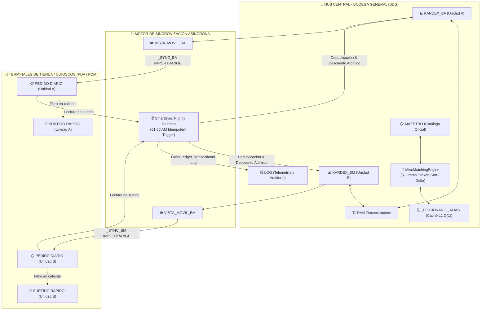

# ⚡ Suite MISE · Enterprise Inventory & Supply Chain Engine
> **Plataforma Integral de Telemetría de Inventarios, Reconciliación Inteligente de Insumos, Picking Dinámico y Sincronización Asíncrona para Cadenas Retail y Restauración.**

[](CHANGELOG_PUBLIC.md)
[](https://developers.google.com/apps-script)
[](https://github.com/google/clasp)
[](tests/)
[](#-arquitectura-del-sistema)
[](LICENSE)
[](#)

---

## 🧭 Propósito y Contexto Operativo

**Suite MISE** es un motor distribuido de gestión de almacenes y cadena de suministro construido sobre el entorno V8 de **Google Apps Script** y **Google Sheets**, diseñado para resolver la fricción crítica entre centros de distribución generales (bodegas) y puntos de venta periféricos (quioscos y tiendas).

Elimina el desabasto imprevisto, automatiza el cálculo de saldos en tiempo real y ofrece interfaces táctiles de alta velocidad para operarios de almacén y encargados de tienda en dispositivos móviles.

---

## 🏛️ Arquitectura del Sistema

Opera bajo una topología distribuida de **tres niveles (Hub-and-Spoke)** diseñada para desacoplar el módulo central de almacenamiento de las terminales de venta en quioscos, garantizando atomicidad transaccional y cero colisiones operativas:



---

## ⚡ Módulos y Especificaciones Técnicas

1. **Kardex Multi-Worker Concurrente**:
   - Bitácora transaccional por lotes con reconstrucción en memoria RAM para evitar lecturas de rango repetidas en Google Sheets API (`Batch Operations`).
2. **Matching Engine con Resolución Difusa (Fuzzy Matching)**:
   - Resuelve discrepancias ortográficas y de tecleo en nombres de insumos utilizando distancia de Levenshtein, N-Grams y token sort con caché L1 `O(1)`.
3. **Quiosco de Picking y Registro Rápido**:
   - Diálogos modales optimizados (1050x700px en escritorio y responsivos en móviles) para captura táctil ágil sin bloquear la navegación de la hoja.
4. **Sincronización Asíncrona Idempotente**:
   - Trigger programado de conciliación nocturna con hashing de transacciones para garantizar deduplicación exacta.

---

## 🧪 Pruebas Unitarias

La suite incluye una batería de pruebas unitarias que simulan el entorno Google Apps Script en Node.js (V8 VM):

```bash
node tests/run_all.js
```

## 📄 Licencia

Este proyecto está distribuido bajo los términos de la licencia **GNU Affero General Public License v3.0 (GNU AGPLv3)**. Consulta el archivo [LICENSE](LICENSE) para más detalles.

---

## 👨‍💻 Autor & Arquitectura

Diseñado e implementado por **Ibrahim García** ([@ultimaibrahim](https://github.com/ultimaibrahim)) · Guadalajara, México.
